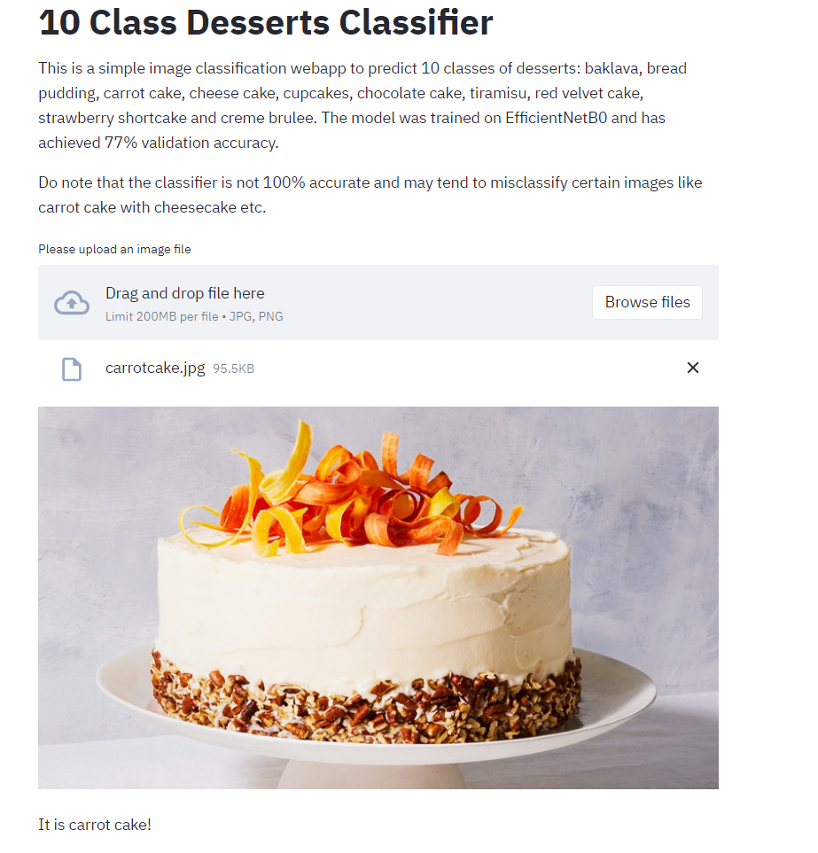
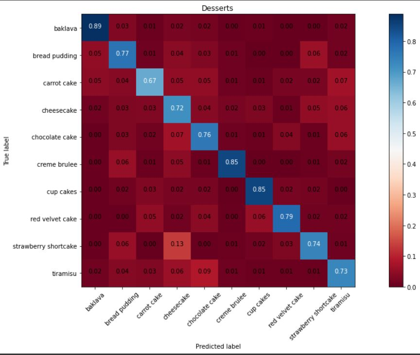

# **Data Science Immersive Capstone: A 10 class dessert classifier**

## **Problem Statement**

Currently, unmanned supermarkets/ convenience stores are gaining traction in China.
Given the current pandemic situation, such a business model is ideal, as it minimizes human contact, and reduces queues.  

**Can we create a food classifier to facilitate self check outs, so as to help retail and fnb businesses save on manpower and productivity costs?**

## **Executive Summary**

For this project, we will be using the food 101 dataset from Kaggle to build a classifier for food. The original dataset can be found [here](https://www.kaggle.com/kmader/food41).  The food 101 dataset comprises 101 categories of food ranging from apple pies to waffles, and each category has 1000 images. From this dataset, we will first be using 5 categories of food to create a 5 class Japanese Food classifier to experiment with fitting it to pretrained models like VGG16. Subsequently for our actual modelling, we will be using another 10 categories of food that are similar to each other, e.g. cake/dessert to train our models with. 

We will also be building our own convolutional neural network and test its performance against a few pre-trained networks like  EfficientNet and VGG16. We will evaluate each model using accuracy as the main metric, finetune and re-evaluate the models before deciding on the best model for production. 

Finally, we evaluate how well our best model can classify unseen data. The dataset, saved weights and checkpoints, as well as images used to test the model can be found [here](https://drive.google.com/drive/folders/18KPqbs68nf-6sV2v2tRD_hCcfwdXxla9?usp=sharing).

## **Methodology**
For this project, we did a dataset exploration by visualising the images and plotting bar charts to check if there was class imbalance. As part of our EDA, we also experimented with transfer learning by creating a 5 class Japanese food classifier using VGG16, which achieved a validation accuracy of 84.8%. It was able to predict unseen images correctly. 

Subsequently, we then created a 10 class dessert dataset and fit our dataset on the following models: 
1) Custom made convolutional neural network   
2) Transfer learning with VGG16  
3) Transfer learning with EfficientNetB0  

We also tuned and refitted the models.  
For 1) Custom made convolutional neural network:  
-Added BatchNormalization layers to regularize the model and control overfitting  
-Used RandomSearch from Keras Tuners to find best parameters for dense layers and learning rate  

For 2) and 3):  
- Applied image augmentation to EfficientNetB0 model 
- Kept batch normalization layers frozen for EfficientNetB0 model 
- Unfreeze one block from top layer of the models to retrain for both models 

We also analysed the misclassified images. Our best model was not able to predict 559 out of 2500 validation dataset images correctly. The most misclassified classes were carrot cake, followed by cheese cake and tiramisu. 

Finally, we built a food classification webapp with our best model using Streamlit. It can be found on this [link](https://share.streamlit.io/kevwee-lab/dessertclassifier_webapp/main/foodclass_app.py).

## **Findings**

| Model     | Val Accuracy (before tuning) | Val Accuracy (after tuning)|
| ----------- | ----------- |--------|
| Custom CNN     | 46.3%     | 56.7%|
| VGG 16  |  59%     | 75.6%|
| EfficientNetB0| 73.2%| 77.6%| 

 

Our best model is the tuned EfficientNetB0, achieving a validation accuracy of 77.6%. Looking at the confusion matrix, we see that it can predict most classes reasonably well, with the exception of carrot cake. We also see that tiramisu is most often misclassified as chocolate cake and strawberry shortcake is most often misclassified as cheese cake. This seems to be quite a reasonable misclassification.
  

 
Our best model could also generalise on unseen data pretty well, accurately predicting 9 out of 10 classes, with the exception of cheesecake, which it predicted as carrot cake. 

## **Conclusions**
To address our problem statement, we have built a 5 class Japanese Food classifier with validation accuracy of around 85% and a 10 class desserts classifier with a validation accuracy rate of around 77%. There is definitely room for improvement, as our model still tends to misclassify some categories, such as predicting cheesecake as carrot cake.

### **Room for improvement/Recommendations**
If we were to deploy such a solution to production and eventually for usage in unmanned retail and fnb stores, more work will need to be done, in terms of the following:  
1) Training the model with more data of the food at different camera angles and heights  
2) Training the model with more classes if we have more computational power and time 
3) Tuning the model for better accuracy by varying the layers to freeze during training, and use other techniques ensemble models, or image augmentation techniques such as CutMix.  
4) Creating an object detection model so that we can count the quantity of items detected.

## **Acknowledgments**
This project would not be possible without referencing the following sources: 
1. [Keras tutorial on fine-tuning efficientnet](https://keras.io/examples/vision/image_classification_efficientnet_fine_tuning/)  
2. [Our TA Zaini's sharing of his capstone project](https://github.com/zainichia)  
3. [Keith Galli's video on using Keras Tuner](https://www.youtube.com/watch?v=44U8jJxaNp8&ab_channel=KeithGalli)  
4. [Tensorflow tutorial on Keras Tuner](https://www.tensorflow.org/tutorials/keras/keras_tuner) 
5. [K Scott Mader's dataset and code on creating a simple CNN ](https://www.kaggle.com/kmader/simple-cnn#Building-the-network)  
6. [Jason Brownlee's article on Batch Normalization](https://machinelearningmastery.com/batch-normalization-for-training-of-deep-neural-networks/)  
7. [Ruben Winastwan's article on deploying webapp with Streamlit](https://towardsdatascience.com/deploying-an-image-classification-web-app-with-python-3753c46bb79)  

